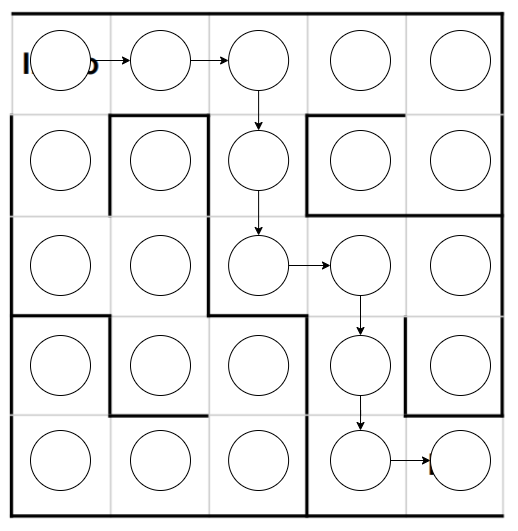

## Objetivo geral
Encontrar a saída de um labirindo representado por um grafo dirigido por meio de um algoritmo de busca em profundidade.

## Estratégias adotadas
1. Dado um grafo de n vertíces, definir a entrada como o vertíce 0 e a saída como o vértice n-1; e
2. Dado um grafo de n vertíces com apenas uma fonte e apenas um sorvedouro, definir eles respectivamente como entrada e saída.

## Desenvolvimento
A partir dos exemplos disponibilizados, um grafo dirigido foi montado:

| Modelo de labirinto | Definição de vértices | Caminho principal | Caminhos alternativos | Numeração |
|--------------|-----------|------------|-----------|------------|
|  | | |  |  |

Um algoritmo simples de busca em profundidade foi manejado de forma que encerrasse sua execução ao encontrar o vértice de saída do grafo, uma vez que não é necessária a descoberta de outros caminhos.

## Bibliotecas externas
[graphviz](https://github.com/xflr6/graphviz) - Para visualização opcional do grafo inserido em formato .dot
